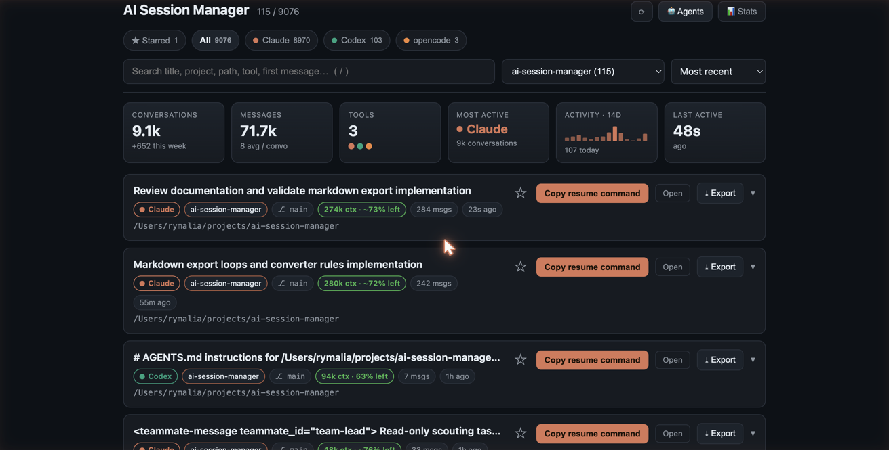
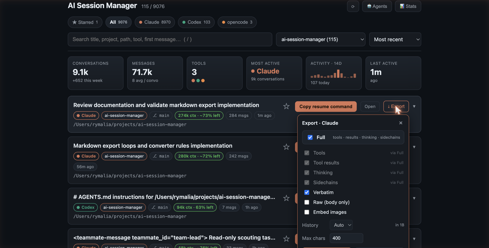
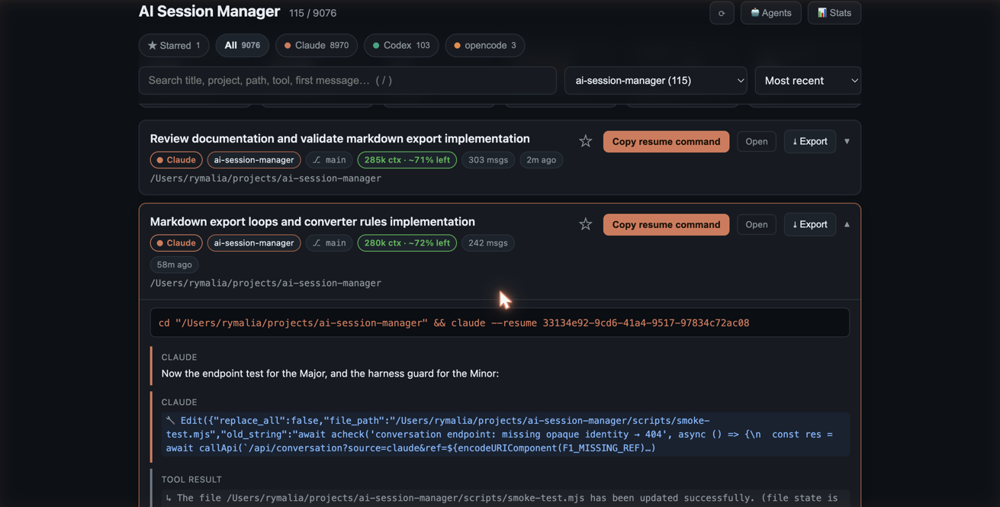
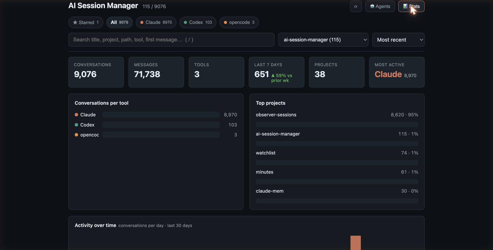
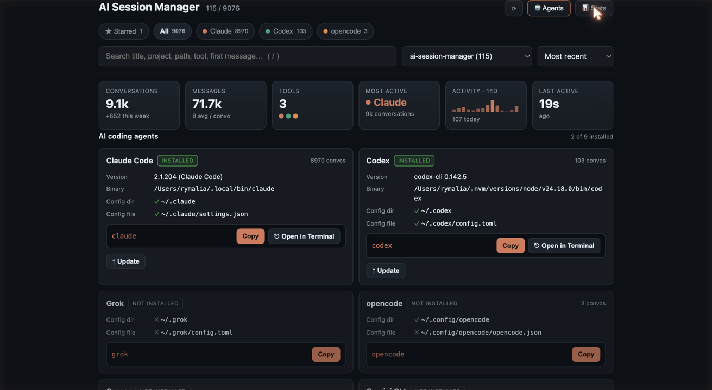
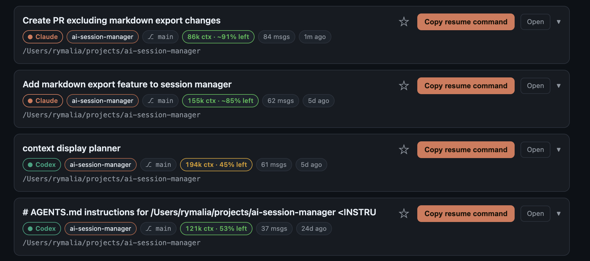

# AI Session Manager

A small Vite + React app that lists your local AI-coding-CLI conversations
across **multiple tools**, lets you search/filter them, preview the last 30
messages, and copy a ready-to-run command to resume any session.

Browse, search, and resume your local AI-coding-CLI sessions — **Claude Code,
Codex, Grok, opencode, Cursor, Gemini, Copilot, Goose, Droid, Kimi Code** — in
one place.
Preview the last 30 messages, see how much context each session has left, and
export any session to Markdown. **Local-first: it only reads transcripts these
tools already wrote under your home directory, and nothing ever leaves your
machine.**

## Screenshots

<p align="center">
  
</p>

One unified, searchable list across every installed tool — filter by tool and
project, sort, star, and read each session's context-health badge before you
decide to resume it.

<table>
<tr>
<td width="50%" valign="top">
  
  <br><b>Export to Markdown</b> — send any session to a clean Markdown file, with per-flag control over tools, thinking, subagent sidechains, and <code>history.jsonl</code> backfill.
</td>
<td width="50%" valign="top">
  
  <br><b>Read without resuming</b> — expand any card for the last 30 messages, color-coded by author with tool calls and results inlined.
</td>
</tr>
<tr>
<td width="50%" valign="top">
  
  <br><b>Stats</b> — totals, per-tool and per-project breakdowns, and a 30-day activity chart, all from local data.
</td>
<td width="50%" valign="top">
  
  <br><b>Agents</b> — which CLIs are installed, their versions and config, with copy-able launch and update commands.
</td>
</tr>
</table>

<p align="center">
  
</p>

**Context-health badges** estimate how much of each session's context window is
still free — green when there's room, amber when it's getting tight — so you can
tell which sessions are worth resuming without opening them.

## Supported tools

| Tool | Storage read | Resume command |
|------|--------------|----------------|
| **Claude Code** | `~/.claude/projects/**/*.jsonl` | `claude --resume <id>` |
| **Codex** | `~/.codex/sessions/**/rollout-*.jsonl` (+ `session_index.jsonl` for titles) | `codex resume <id>` |
| **Grok** | `~/.grok/sessions/<cwd>/<id>/{summary.json,chat_history.jsonl}` | `grok --resume <id>` |
| **opencode** | `~/.local/share/opencode/opencode.db` (SQLite) | `opencode --session <id>` |
| **Cursor** | `~/.cursor/projects/<cwd>/agent-transcripts/<id>/<id>.jsonl` | `cursor-agent --resume <id>` |
| **Gemini CLI**¹ | `~/.gemini/tmp/<hash>/checkpoint*.json` | `gemini` → `/chat resume <tag>` |
| **GitHub Copilot CLI**¹ | `~/.copilot/history-session-state/*.json` | `copilot --resume <id>` |
| **Goose**¹ | `~/.local/share/goose/sessions/*.jsonl` | `goose session resume --name <id>` |
| **Droid**¹ | `~/.factory/sessions/*.json` | `droid --resume <id>` |
| **Kimi Code**² | `~/.kimi-code/sessions/**/agents/*/wire.jsonl` (+ `session_index.jsonl` + `state.json`) | `kimi -S <id>` |

¹ Format-based adapter, written to the tool's documented/expected on-disk
layout. Each returns nothing until that tool is used (or example data is
present); open an issue / tweak the adapter if a real install stores things
differently.

² List, detail, and usage only — Markdown export is **not** supported for Kimi
(that is a later phase). Subagent wires are merged into the session preview with
visible provenance.

Only the tools that are actually present on the machine show up; a missing or
empty data dir is silently skipped.

## Privacy & security

- **Everything stays local.** The app reads transcripts other CLIs already
  wrote to your home directory and serves them to your own browser. No
  telemetry, no network calls, nothing bundled or uploaded.
- The server binds to **localhost only** (enforced in `vite.config.js`). Don't
  run it with `--host` — the API would serve your private conversation history
  to anyone who can reach the port.
- Every adapter validates its `ref` so the API can only read inside that
  tool's own data directory (path-traversal and sibling-prefix refs are
  rejected — covered by the smoke tests). `/api/open` validates paths and
  spawns the OS opener via `execFile` with an args array, never a shell.

## Platform support

- **macOS** — everything works, including "Open Terminal" in the Agents panel.
- **Linux** — works; folder-open uses `xdg-open`, agent terminals use the
  first of `x-terminal-emulator`/`gnome-terminal`/`konsole`/`xterm` found.
- **Windows** — the viewer and adapters work for tools that use the same
  `~/...` layouts; folder-open uses `explorer`, agent terminals use
  `start cmd /k`. Less battle-tested than macOS/Linux — reports welcome.

## Run

```bash
npm install
npm run dev      # opens http://localhost:5191
npm test         # smoke-test every adapter + endpoint against your local data
npm run build && npm run preview   # serve the production build (API included)
```

The API runs as a Vite middleware on **both** the dev server and the preview
server, so the built `dist/` works end-to-end via `npm run preview` (it still
reads your local transcripts — nothing is bundled or sent anywhere).

Requires Node 24+ (the opencode adapter uses the built-in `node:sqlite`).

`npm test` (`scripts/smoke-test.mjs`) lists every source, fetches a detail per
source, and validates the data contract (unique keys, no missing fields / future
timestamps, valid message roles, newest-first ordering), plus the usage and
open-path modules. Exits non-zero on any failure. On a machine with no AI-CLI
data yet, the data-dependent checks are skipped.

### Run at startup (optional)

With [pm2](https://pm2.keymetrics.io/):

```bash
pm2 start npm --name ai-session-manager --cwd /path/to/this/repo -- run dev
pm2 save
pm2 startup   # follow the printed instructions for your OS
```

## Configuration (optional)

The viewer is zero-config by default. The one thing you can configure is a
**blocklist** of projects to hide — useful when a tool writes machine-generated
sessions into your home directory and they swamp the real work.

Create `~/.config/ai-session-manager/config.json` (override the location with
`$ASM_CONFIG`):

```json
{
  "blocklist": [
    "/Users/me/.claude-mem/observer-sessions",
    "~/scratch"
  ]
}
```

- **Matching is by path prefix, never by name.** An entry hides a project whose
  path is that directory or anything beneath it. Sibling directories that merely
  share a textual prefix are not affected — blocking
  `~/.claude-mem/observer-sessions` leaves both `~/projects/claude-mem` and
  `~/.claude-mem/observer-sessions-2` fully visible. Entries must be absolute
  (`~` is expanded); relative entries are ignored.
- **Hidden means hidden everywhere**: the session list, the project dropdown,
  content search, the Stats panels, the Agents conversation counts, and the
  Usage token totals. A blocked session can't be opened or exported by ref
  either, so an old bookmark or star doesn't reveal one.
- **The file is only ever read.** ASM never writes it (or anything else) — edit
  it by hand and press Refresh in the UI; no restart needed.
- **Mistakes fail open.** A missing, unreadable, or malformed config, or an
  invalid entry inside a good one, means *less* hiding, never more — a typo can
  never silently make real sessions disappear.
- **Rules that hide nothing say so.** An entry matching no sessions logs a line
  in the server terminal, because a dead rule otherwise looks exactly like a
  working one. The common mistake is naming where a CLI *stored* the transcript
  rather than the project you worked in, so those are called out by name:

  ```
  [config] blocklist entry matched no sessions:
    "~/.claude/projects/-Users-me-projects-app" — Claude Code's transcript
    storage, not a project directory. Entries match the directory you worked IN
    (the session's cwd). Did you mean "/Users/me/projects/app"?
  ```

Two Usage figures are deliberately *not* filtered, because they aren't
per-project facts: Codex's remaining-quota snapshot (an account-level number —
dropping it would report stale quota rather than a smaller one) and Cursor's
AI-edit tallies (whole-database counters with no session→project link).

## How it works

- A tiny dev-server API (in `vite.config.js`) delegates to one **source adapter**
  per tool under `server/sources/`. Each adapter exports `{ source, list, detail }`
  and returns a normalised record, so the API contract is identical across tools.
  `server/sources/index.js` aggregates them — a failing source is skipped rather
  than taking the whole response down.
- `GET /api/conversations` returns one entry per top-level session (source, title,
  project, branch, message count, last activity, ready-to-run resume command),
  merged across tools and sorted most-recent first. Summaries are cached by
  file/row mtime so reloads are instant.
- `GET /api/conversation?source=…&ref=…` returns the last 30 messages for one
  session. Each adapter validates its own `ref` (path must stay within that
  tool's data dir; opencode session ids are pattern-checked).
- `GET /api/sources` returns display metadata (label + accent colour) per tool.
- `GET /api/export?source=…&ref=…` renders one session to Markdown. Export-capable
  adapters (currently Claude and Codex) add a `collectEvents` + `exportCapabilities`
  surface on top of the base contract; the architecture notes live in
  [`CLAUDE.md`](CLAUDE.md).

## Adding another tool

Drop a `server/sources/<tool>.js` that exports `source`, `list()`, and
`detail(ref, lastN)` (return normalised entries via `makeEntry` from
`_shared.js`), then register it in `server/sources/index.js` and add an entry to
`SOURCE_META`. No other code needs to change.

## Features

- **Search** across title, project, path, session id, tool name, and first message.
- **Filter** by tool (chips with per-tool counts) and by project (dropdown,
  scoped to the active tool).
- **Sort** by most recent / oldest / most messages / title / tool.
- **Filters persist** across refresh (search, tool, project, sort, and the stats
  toggle are saved to `localStorage` under `ccv.filters`).
- **Expand** any card to read the last 30 messages, color-coded and labelled with
  the originating assistant (Claude / Codex / Grok / opencode / Cursor / …), with
  tool calls and results inlined.
- **Context-health badge** — each card estimates how much of the model's context
  window the session has consumed (green → room to spare, amber → nearly full),
  from what each CLI records locally (`server/contextUsage.js`).
- **Export to Markdown** — download or copy a Claude/Codex session as Markdown
  (`GET /api/export`), with per-flag control over tools, tool results, thinking,
  subagent sidechains, and `history.jsonl` backfill. Output mirrors the CLI's own
  replay; see the export notes in [`CLAUDE.md`](CLAUDE.md).
- **Copy resume command** — the exact `cd "<cwd>" && <tool> resume …` for that tool.
- **Open** — opens the conversation's project folder in the OS file manager
  (`GET /api/open` → `open`/`xdg-open`/`explorer`, path-validated, no shell).
- **Stats panel** (📊 toggle):
  - *Metrics* (`src/Metrics.jsx`) — conversations per tool, top projects, and a
    30-day activity sparkline, all hand-rolled inline SVG (no chart lib).
  - *Usage & quota* (`server/usage.js` → `GET /api/usage`) — per-tool usage read
    from local data: Codex rate-limit **quota left**, opencode/Claude/Grok/Kimi
    token totals, Cursor edit-tracking; Gemini marked N/A (no local data). Read-only.
- **PWA** — installable (`public/manifest.webmanifest`, `public/sw.js`,
  icons; registered via `src/pwa.js`). The service worker is network-first so it
  never serves stale content and doesn't interfere with dev/HMR; `/api/*` is
  always network.

## License

[MIT](LICENSE)
